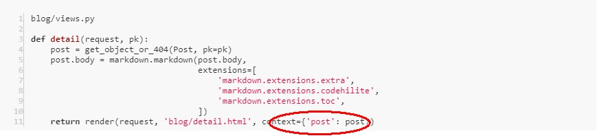

---
## ● 第三次的作业：
### 1. url如何传递参数,views中的函数如何接收该参数

##### URL中传参数，例如：'posts/<int:pk>/' ———— posts/ 后跟一个参数名为“pk”的整数即可。
##### （还有 str 字符类型、uuid 等，可以通过官方文档了解：[Path converters](https://docs.djangoproject.com/en/2.2/topics/http/urls/#path-converters)）
    
##### views中的函数接收参数：

### 2. views中的函数,如何向html传参;html摸板中如何接收该参数
##### views中调用django提供的render函数，这个函数根据我们传入的参数context，向html传参，如下：

##### html摸板中接收该参数的方法是——{{ post.xxx }}  或可以加上 safe 过滤器，如：{{ post.body|safe }}
### 3. html摸板为何有继承的语法?如何实现继承?什么情况下需要继承?
##### 1. html摸板为何有继承的语法？—— 可能是因为模板中存在相同的部分，需要抽取出来，更好维护吧
##### 2. 如何实现继承？—— 例如：把相同的部分抽取出来，放到公共的base.html里，在需要引用的模板文件最顶部使用\{% extends 'base.html' %\}继承base.html
##### 3. 什么情况下需要继承？ —— 存在相同的部分且会被多次用到，可把公共部分的代码放在 base.html 里，而其它页面不同的部分通过替换占位标签里的内容即可。
### 4. 什么情况下需要覆写model中的save方法?
##### 在保存数据库前对某些值做特殊处理需要覆写model中的save方法，比如填充某个缺失字段的值等等
### *疑问点*：
#####  根据[让博客支持 Markdown 语法和代码高亮](https://www.zmrenwu.com/courses/hellodjango-blog-tutorial/materials/67/)中写的：通过 CDN 引入 highlight.js 和 highlightjs-line-numbers.js 未实现代码高亮？

---
***
___
## 1. 描述一个完整的http(s)请求都经历哪些环节
##### 1. 当用户输入一个http网址后，django首先会把协议 http、域名和端口号去掉，此时剩下的字符串，django会去urls.py这里找；
##### 2. 找到匹配的后，django便会调用与其绑定在一起的视图函数。相当于从urls导入的path函数中，找到了对于的views模块。
##### 3. 在对应的视图函数中，会接收request的参数，views中处理完之后，html接收到这个响应后就会在页面上显示出对应的内容。

