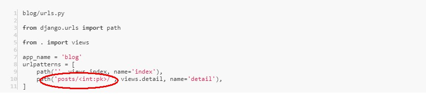
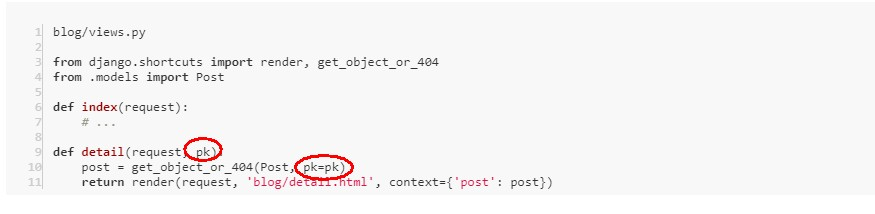

---
## ● 第三次的作业任务：
### 1. url如何传递参数,views中的函数如何接收该参数
    
##### URL中传参数，例如：'posts/<int:pk>/' ———— posts/ 后跟一个参数名为“pk”的整数。
##### （还有 str 字符类型、uuid 等，可以通过官方文档了解：[Path converters](https://docs.djangoproject.com/en/2.2/topics/http/urls/#path-converters)）
    
##### views中的函数接收参数：
    
### 2. views中的函数,如何向html传参;html摸板中如何接收该参数
##### views中的函数，可以把 Markdown 文本转为 HTML 文本再传递给模板，如下：
    
##### html摸板中接收该参数的方法是——加上 safe 过滤器：{{ post.body|safe }}
### 3. html摸板为何有继承的语法?如何实现继承?什么情况下需要继承?
##### html摸板为何有继承的语法？—— 可能是因为模板中存在相同的部分，需要抽取出来，更好维护吧
##### 如何实现继承？—— 例如：把相同的部分抽取出来，放到公共的 base.html 里，在需要引用的模板文件最顶部使用  继承 base.html
##### 什么情况下需要继承？ —— 存在相同的部分且会被多次用到，可把公共部分的代码放在 base.html 里，而其它页面不同的部分通过替换占位标签里的内容即可。
### 4. 什么情况下需要覆写model中的save方法?
##### 在保存数据库前对某些值做特殊处理需要覆写model中的save方法，比如填充某个缺失字段的值等等
### 疑问点：
#####  根据[让博客支持 Markdown 语法和代码高亮](https://www.zmrenwu.com/courses/hellodjango-blog-tutorial/materials/67/)中写的：通过 CDN 引入 highlight.js 和 highlightjs-line-numbers.js 未实现代码高亮？

---
