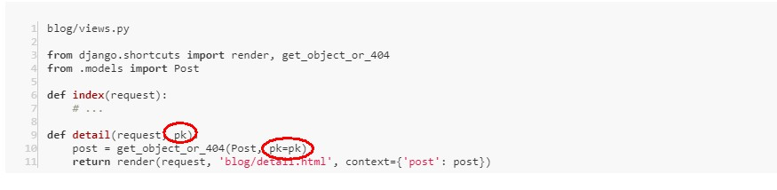

---
## ● 第一次的作业

### 1. 安装pycharm专业版。重点在于如何激活。请搜索并形成笔记。
##### 从网上搜索，并试行，最后是用了下面这个地址的方法 [激 活 ](https://zhile.io/2018/08/17/jetbrains-license-server-crack.html)成功了：

- 使用方法:
  1. 先下载压缩包解压后得到jetbrains-agent.jar。
   [下载页面：](https://zhile.io/2018/08/17/jetbrains-license-server-crack.html)
  2. 启动你的IDE，如果上来就需要注册，选择：试用（Evaluate for free）进入IDE。
   如果你的IDE试用已过期可以使用reset_eval文件夹内的脚本重置一下。
  3. 将 jetbrains-agent.jar 拖进IDE窗口（或者当作IDE插件安装），点 "Restart" 按钮重启IDE。
  （事实上你拖 jetbrains-agent-latest.zip 进去IDE窗口也没问题，我就是用的这个方式）
  4. 在弹出的JetbrainsAgent Helper对话框中，选择激活方式，点击安装按钮。
  5. 重启IDE，搞定。（我是重启了电脑）

### 2. 创建一个Django项目，熟悉setting文件。请说出至少5个配置项的作用。
##### LANGUAGE_CODE  可进行中英文切换
##### TIME_ZONE  时区的配置
##### INSTALLED_APPS  自身的内置应用 也可以添加应用
##### DATABASES  默认的数据库配置
##### ROOT_URLCONF   根目录url的配置

### 3. 熟悉manage命令，了解其作用。
#####	python manage.py runserver        本机上开启一个 Web 服务器
#####	python manage.py startapp             创建某个应用
#####	python manage.py makemigrations        django 在应用的 migrations 目录下生成了一个 0001_initial.py 文件，这个文件是 django 用来记录我们对模型做了哪些修改的文件
#####	python manage.py migrate              django 通过检测应用中 migrations 目录下的文件，得知我们对数据库做了哪些操作，然后它把这些操作翻译成数据库操作语言，从而把这些操作作用于真正的数据库里
#####	python manage.py createsuperuser       创建用户

---
## ● 第二次的作业

### 1. 描述一个完整的http(s)请求都经历哪些环节
##### 1）输入访问的网址，浏览器帮我们通知网址的服务器，访问的请求都在HTTP报文里，
##### 2）服务器接收到这个HTTP请求后，后台处理完（比如把想要的数据从数据库中读取出来），
##### 3）返回相应的HTTP响应。浏览器解读后，相关的内容就在呈现出来了。
	
### 2. 说明你所知道的django目录结构，每个目录的作用

### 3. model常用字段及其参数含义
##### （model里面的类名即表名，类的属性对应着表格的列，属性名即列名）
##### 1. CharField 指定了分类名 name 的数据类型，CharField 是字符型，CharField 的 max_length 参数指定其最大长度，超过这个长度的分类名就不能被存入数据库。指定 CharField 的 blank=True 参数值后就可以允许空值了。
##### 2. 存储时间的字段用 DateTimeField 类型、整数类型 IntegerField、存储大段文本使用 TextField。
##### 3. ForeignKey，即一对多的关联关系。ForeignKey 必须传入一个 on_delete 参数用来指定当关联的数据被删除时，被关联的数据也同时被删除。使用 models.CASCADE 参数，意为级联删除。
##### 4. ManyToManyField，表明这是多对多的关联关系。可设置参数指定 blank=True。

---

---
## ● 第三次的作业：
### 1. url如何传递参数,views中的函数如何接收该参数

##### URL中传参数，例如：'posts/<int:pk>/' ———— posts/ 后跟一个参数名为“pk”的整数即可。
##### （还有 str 字符类型、uuid 等，可以通过官方文档了解：[Path converters](https://docs.djangoproject.com/en/2.2/topics/http/urls/#path-converters)）
    
##### views中的函数接收参数：

### 2. views中的函数,如何向html传参;html摸板中如何接收该参数
##### views中的函数，可以把 Markdown 文本转为 HTML 文本再传递给模板，如下：

##### html摸板中接收该参数的方法是——加上 safe 过滤器：{{ post.body|safe }}
### 3. html摸板为何有继承的语法?如何实现继承?什么情况下需要继承?
##### 1. html摸板为何有继承的语法？—— 可能是因为模板中存在相同的部分，需要抽取出来，更好维护吧
##### 2. 如何实现继承？—— 例如：把相同的部分抽取出来，放到公共的base.html里，在需要引用的模板文件最顶部使用\{% extends 'base.html' %\} 继承base.html
##### 3. 什么情况下需要继承？ —— 存在相同的部分且会被多次用到，可把公共部分的代码放在 base.html 里，而其它页面不同的部分通过替换占位标签里的内容即可。
### 4. 什么情况下需要覆写model中的save方法?
##### 在保存数据库前对某些值做特殊处理需要覆写model中的save方法，比如填充某个缺失字段的值等等
### *疑问点*：
#####  根据[让博客支持 Markdown 语法和代码高亮](https://www.zmrenwu.com/courses/hellodjango-blog-tutorial/materials/67/)中写的：通过 CDN 引入 highlight.js 和 highlightjs-line-numbers.js 未实现代码高亮？

---
***
___

